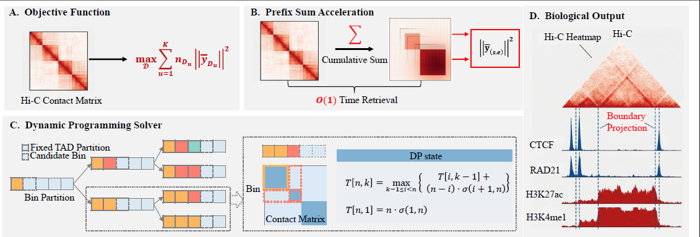

# CHORD: Deterministic Demarcation of Topologically Associating Domains via Exact Optimization

CHORD is a robust computational framework that fundamentally shifts the paradigm of TAD detection from heuristic approximation to exact mathematical solving. By rigorously optimizing the Calinski-Harabasz (CH) index via dynamic programming and 2D prefix sum acceleration, CHORD guarantees the identification of global optima, ensuring highly stable performance even under extreme data sparsity and noise.



## 📂 Repository Structure

The repository is kept ultra-lightweight and highly integrated.

```text
CHORD/
├── chord.py                         # The core algorithm and visualization script (All-in-one)
└── data/                            # Sample datasets for testing
    ├── simulated_data.txt           # Simulated Hi-C matrix for algorithmic validation
    ├── mat_50k_KR_p_arm.txt        # GM12878 Chr7 (0-58.1Mb) at 50kb resolution      
    └── mat_50k_KR_chr7_23_27Mb.txt  # High-resolution sub-matrix of Chr7 (23-27Mb) at 50kb 
```

## ⚙️ Requirements

CHORD is developed using **Python 3.11** and requires minimal external dependencies.
Please ensure the following packages are installed in your environment:

* `numpy`
* `scikit-learn`
* `matplotlib`
* `seaborn`
* `tqdm`

## 🚀 Usage

CHORD requires a normalized intra-chromosomal Hi-C contact matrix as input (tab or space-separated pure numeric text file, without headers or bin annotations). 

### 1. Standard Global Run (Recommended)
By default, CHORD operates entirely parameter-free. It uses the Silhouette Score to automatically determine the mathematically optimal number of structural domains across the input matrix.

```bash
python chord.py --matrix data/mat_50k_KR_p_arm.txt --out_boundary result.txt --out_image tad_heatmap.png
```

### 2. Advanced Usage: Localized Customized Exploration
While CHORD perfectly captures the global mathematical optimum for large-scale matrices, researchers analyzing highly localized micro-regions (e.g., specific gene loci or enhancer clusters) often possess strong biological priors. To provide maximum flexibility for customized exploratory analysis or to align with specific experimental hypotheses, CHORD provides the `--k` parameter. 

This allows users to bypass the automatic selection and manually specify the desired number of domains for targeted structural dissection:

```bash
python chord.py --matrix data/mat_50k_KR_chr7_23_27Mb.txt --k 14 
```

### Command Line Arguments
* `--matrix` : (Required) Path to the input Hi-C matrix file.
* `--k` : (Optional) Force a specific number of TADs (bypasses automatic Silhouette selection).
* `--out_boundary` : (Optional) Output filename for the TAD boundaries. Default: `result.txt`.
* `--out_image` : (Optional) Output filename for the visualization heatmap. Default: `tad_heatmap.png`.
* `--cmap` : (Optional) Matplotlib colormap for the heatmap (e.g., `Reds`, `Blues`, `viridis`). Default: `Reds`.

## 📊 Output

CHORD generates two outputs seamlessly:

1. **Boundary File (`result.txt`)**: A clear, tab-separated text file listing the Start and End bin indices (1-based) of the identified domains.
```text
Start_Bin    End_Bin
1            12
13           24
...
```

2. **Visualization Heatmap (`tad_heatmap.png`)**: A publication-ready, high-resolution heatmap overlaid with crisp bounding boxes precisely demarcating the identified TAD structures.

## 📖 Citation

If you use CHORD in your research, please cite our paper:

## ✉️ Contact
For any questions, bug reports, or feature requests, please open an issue on GitHub. email: zhaoling2-c@my.cityu.edu.hk
